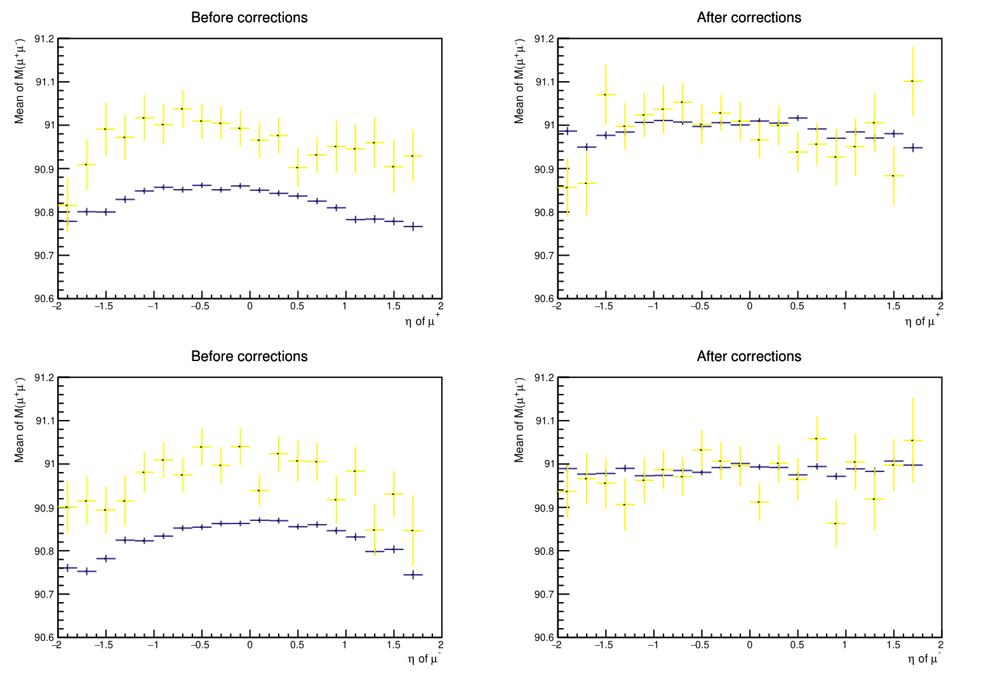

# MuonCorrections

## Description

This repository contains code and instructions for using the Rochester corrections for muon momentum scale and resolution. The corrections are used to compensate for the misalignments in data and Monte Carlo that the CMS reconstruction software does not fully correct. The misalignments for data and MC are different and corrections have been extracted for both.

These instructions are for the Run1 corrections and a [2012 dataset](http://opendata.cern.ch/record/12341) and a Monte Carlo dataset is used as an example. `RochesterCorrections` contains the official code for the corrections from the Muon POG. `Test` contains `Analysis.C` which reads the datasets, applies the corrections to a muon pair, computes invariant mass and produces an output-file with the corrected data. `Plot.C` creates the plot below which shows that the corrections have been applied correctly. `Plot.C` is based on [this](https://cms-opendata-workshop.github.io/workshop-lesson-tagandprobe/index.html) Tag and Probe Method tutorial.



## Usage instructions
1. Open ROOT in terminal
```
root
```

2. Compile `muresolution.cc`, `rochcor2012wasym.cc` and `Analysis.C`
```
.L RochesterCorrections/muresolution.cc++
.L RochesterCorrections/rochcor2012wasym.cc++
.L RochesterCorrections/Test/Analysis.C+
```

3. Run the main function
```
Analysis pf
pf.main()
```
4. Compile `Plot.C` and run the main function
```
.L RochesterCorrections/Test/Plot.C+
main()
```

## Other usage options

### Different dataset

You can use `Analysis.C` to apply the corrections to different datasets. However, a few changes needs to be made for the code to work correctly. The first thing that needs to be changed is the main function. Call `applyCorrections` in the main function using the parameters that correspond your dataset.

- `nameOfFile`: the name of your ROOT-file without the `.root`-part
- `pathToFile`: path to your ROOT-file
- `treeName`: the name of the tree in your ROOT-file
- `isData`: `true` for data, `false` for MC
- `correctAll`: `true` / `false`, explained below

```
void Analysis::main()
{
  // Your dataset
  applyCorrections("nameOfFile", "pathToFile", "treeName", isData, correctAll);
}
```

The second thing you need to do is check the names and data types of the branches in your dataset. For example, instead of the name `nMuon` for the number of muons in an event you might have `numberOfMuons` and instead of data type `Muon_pt[nMuon]` you might have `vector<float> Muon_pt`. The correct name needs to be changed to the branch address and the data type needs to be corrected in the `applyCorrections` function. If you have a vector, you might need to change `Muon_pt[i]` to `Muon_pt->at(i)` or something similiar later in the code. Example:

```
  //Variables to hold values read from the tree
  int maxmuon=1000;
  UInt_t nMuon = 0;
  vector<float>* Muon_pt;

  //Set addresses to make the tree populate the variables when reading an entry
  DataTree->SetBranchAddress("numberOfMuons", &nMuon);
  DataTree->SetBranchAddress("Muon_pt", &Muon_pt);
```

### correctAll

Creating the plot above requires making selections and the produced dataset contains only a part of the initial dataset. These selections can be skipped when the plot is not needed and a corrected version of the whole dataset is wanted as a result. To do this, simply give `true` as the last parameter when calling `applyCorrections`. The code will then loop over the events, select events with muons and correct the muons. Give `false` as the last parameter when you want to create the plot.
 
### Using an older version of ROOT

This code was written using the ROOT version 6.22.08. If you are using an older version, you might get errors running the code. In this case, try using `rochcor2012wasym_old.h` instead of `rochcor2012wasym.h`. You can do this by changing the first line of `rochcor2012wasym.cc` to `#include "rochcor2012wasym_old.h"`.
